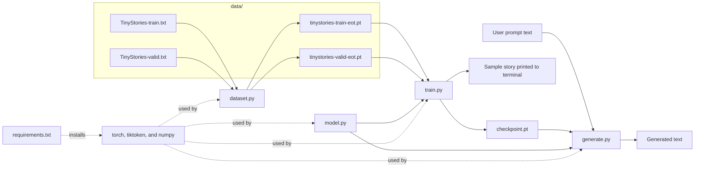
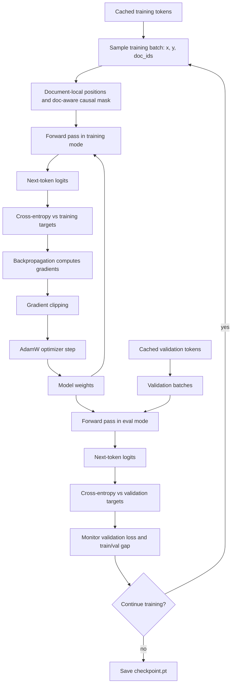
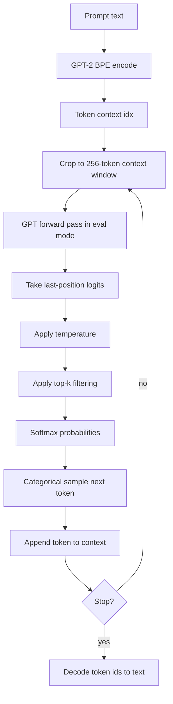

# PyTrain — A Tiny GPT, Trained From Scratch

This project builds a small version of the AI that powers ChatGPT — from scratch, in about 350 lines of Python.

A from-scratch GPT-style language model in [PyTorch](#g-pytorch), sized to train on a single Apple Silicon Mac in under an hour. ([**GPT**](#g-gpt) = Generative Pre-trained Transformer: a [decoder-only](#g-decoder-only) [Transformer](#g-transformer) that generates text *[autoregressively](#g-autoregressive)* — one [token](#g-token) at a time, each conditioned on what came before.) The configured model is 51M [parameters](#g-parameter), trained on the TinyStories corpus (~470M tokens), reaching [validation](#g-validation) *[perplexity](#g-perplexity)* ≈ 3.8 ([perplexity](#g-perplexity) is the exponential of [cross-entropy](#g-cross-entropy), $e^{\text{cross-entropy}}$, roughly "the effective number of equally-likely guesses the model is averaging over for each token" — lower is better).

The point of this repository isn't to compete with production language models — it's to make every part of a GPT *legible*. No trainer frameworks, no high-level model libraries, no hidden abstractions: just [PyTorch](#g-pytorch) tensors and modules. The core model is about 120 lines, and the full project is about 350 lines of Python total. The main equations you'll read below map directly to the code.

## How to use this README

- **Just want to run it?** Start with [Quick start](#quick-start), then [Generating text](#generating-text).
- **New to transformers?** Read [Concept](#concept), [Software structure](#software-structure), then [The math: training](#the-math-training) and [The math: inference](#the-math-inference).
- **Stuck on a term?** Jump to the [Glossary](#glossary). It is intentionally kept in this README so every local link works while you read.
- **Curious how this relates to ChatGPT?** Read [Appendix: How RAG works](#appendix-how-rag-works--documents-as-context-not-training-data) and [Appendix: Modern LLM terms](#appendix-modern-llm-terms-you-will-hear-in-the-industry).

## Table of contents

- [Concept](#concept)
- [Quick start](#quick-start)
- [Generating text](#generating-text)
- [Common problems](#common-problems)
- [Software structure](#software-structure)
- [How to read the equations](#how-to-read-the-equations)
- [The math: training](#the-math-training)
- [The math: inference](#the-math-inference)
- [Glossary](#glossary)
- [References](#references)
- [Appendix: How RAG works](#appendix-how-rag-works--documents-as-context-not-training-data)
- [Appendix: Modern LLM terms](#appendix-modern-llm-terms-you-will-hear-in-the-industry)

---

## Concept

At the highest level, a trained neural language model is easiest to understand in two phases.

**Training** is the learning phase. The model starts with randomly initialized [parameters](#g-parameter) (essentially random numbers) and repeatedly does the same thing: read a chunk of text, predict what token comes next at every position, measure how wrong those predictions are (the *[loss](#g-cross-entropy)*), then nudge every parameter slightly in the direction that would have made the predictions less wrong. Do that billions of times across hundreds of billions of tokens and the parameters gradually encode the patterns of the language. Training is enormously compute-intensive: the largest production models (GPT-4, Llama, Gemini) are trained on clusters of thousands of high-end data-center GPUs running continuously for weeks or months, consuming megawatts of power. This project is small enough to train on a single Apple Silicon Mac in under an hour, but the math is identical.

**Inference** is the generation phase. Once training is finished, the parameters are frozen — no more learning. You feed the model a prompt and it predicts one token at a time, appending each predicted token to the input and repeating until it decides to stop (or you cut it off). Compared to training, inference is far less demanding: there is only one forward pass per token (no [gradient](#g-gradient) computation, no optimizer), and the model only needs to fit in memory once rather than keep gradients and optimizer state around too. That is why ChatGPT can run a response on a handful of GPUs per query, and why on-device models can run on a phone or laptop — though inference still requires meaningful processing power, especially as context length grows.

*A note on modern production LLMs.* What actually gets fed to the model at inference time isn't just the user's message. The inference pipeline assembles a single token sequence from multiple sources: operator-written [system prompts](#g-system-prompt) (defining the model's persona and constraints), prior conversation turns, and sometimes documents found through [retrieval](#g-retrieval) from an external store (a technique called *retrieval-augmented generation*, or [RAG](#g-rag)). The model itself is unaware of these boundaries — it simply predicts the next token given whatever token sequence it receives, regardless of where each segment came from. In a typical ChatGPT exchange, the user's actual message may be a small fraction of the tokens the model processes. This project has none of that machinery: the context window is exactly and only what you pass to `--prompt`, the model has no persistent memory between calls to `generate.py`, no [tool calls](#g-tool-call), and any "personality" in the output comes entirely from patterns in the TinyStories training corpus, not from instructions injected at runtime. For the specific question of context assembly, the underlying math is identical — both this model and a system like ChatGPT run the same transformer forward pass on a flat token sequence, and the model is unaware of how that sequence was assembled. The difference lies entirely in the pipeline that constructs the input.

That said, some production systems also differ from this model *architecturally* in ways context assembly alone does not explain. One common scaling technique is [Mixture-of-Experts](#g-moe) (MoE): rather than using a single shared [MLP](#g-mlp) in each transformer block, a learned [router](#g-router) sends each token to a small subset of parallel "expert" [feed-forward networks](#g-feed-forward-network), keeping computation much smaller than the total number of parameters would suggest. Separately, many [deployments](#g-deployment) use [speculative decoding](#g-speculative-decoding) at inference time, where a small fast draft model proposes candidate tokens and a larger verifier model accepts or rejects them in parallel — two models cooperating rather than one running serially. Neither technique changes the transformer's fundamental input-output contract (token sequence in, logit distribution out), but both go well beyond what a single-network model like this one captures. See [References](#references) below for pointers to some of these.

*If you've ever wondered how a model can usefully answer questions about a document you've just pasted in — a codebase, a policy manual, a datasheet — without having been trained on it, see [Appendix: How RAG works](#appendix-how-rag-works--documents-as-context-not-training-data). The short answer is that the document becomes part of the token sequence, and [self-attention](#g-self-attention) does the rest.*

Everything in this repository illustrates both phases: `train.py` runs [training](#g-training), and `generate.py` runs [inference](#g-inference).

---

## Quick start

```bash
python -m venv .venv && source .venv/bin/activate
pip install -r requirements.txt

python train.py     # downloads ~2GB, tokenizes once, then trains
python generate.py  # samples from the saved checkpoint
```
`train.py` performs the training step and generates the model weights from the training files.  `generate.py` can be run as many times as desired to perform the inference step with your own prompts.

The first run of `train.py` downloads TinyStories (~1.92 GB raw text) and tokenizes it into a cached `.pt` [tensor](#g-tensor) (~3.7 GB). Subsequent runs reuse the cache.

Default training run on a 40-core M-series GPU (MPS): ~45 minutes for 4000 steps. A CUDA GPU (NVIDIA) is similar or faster. CPU-only — a plain Windows or Linux PC with no GPU — will also work; [PyTorch](#g-pytorch) falls back automatically, but expect roughly 10–20× slower, putting the full training run at several hours.

### Generating text

**Basic usage** (uses the default prompt `"Once upon a time"`):
```bash
python generate.py
```

You should see a short story-shaped completion. The exact words will vary because sampling is intentionally random, but it should look roughly like this:

```text
Once upon a time there was a little girl named Lily. She loved to play in the garden...
```

**With your own prompt:**
```bash
python generate.py --prompt "Once upon a time there was a little girl who"
```

**All options:**

| Option | Description |
|---|---|
| `‑‑checkpoint` | Path to the saved model file (default: `checkpoint.pt`) |
| `‑‑prompt` | Text to start generation from (default: `"Once upon a time"`) |
| `‑‑tokens` | Maximum tokens to generate; output may be shorter if the model ends the story naturally (default: `300`) |
| `‑‑temperature` | Randomness control (default: `0.7`) |
| `‑‑top_k` | [Vocabulary](#g-vocabulary) cap per step (default: `40`) |

[Temperature](#g-temperature) scales the [logits](#g-logits) (the model's raw, unnormalized output scores for each token) to control generation randomness: lower values make output more deterministic and repetitive; higher values make it more diverse and incoherent. [Top-k](#g-topk) limits sampling to the $k$ most probable tokens at each step, preventing rare outlier tokens from derailing generation.

**A note on output quality.** This is a 51M-parameter model trained on a children's story corpus. It will produce grammatical, story-shaped text, but don't expect strong long-range consistency — character names may drift mid-story, plot threads may not resolve, and morals may appear or not at random. These are fundamental limitations of the model's size, not bugs. For best results, use simple names common in children's stories (e.g. "Tom", "Lily", "Sam") and keep [temperature](#g-temperature) at 0.7 or below.

**What this model cannot do.** This model is not instruction-tuned, safety-tuned, connected to tools, connected to search, or able to remember anything between runs. It has no [RAG](#g-rag), no [system prompt](#g-system-prompt), no [RLHF](#g-rlhf), no [tool calls](#g-tool-call), and no factual knowledge beyond statistical patterns learned from TinyStories. That is a feature for learning: the model is small enough that the core GPT mechanics are visible.

### Common problems

| Symptom | Likely cause | What to do |
|---|---|---|
| `checkpoint.pt` is missing | `generate.py` needs trained weights | Run `python train.py` first, or place a compatible checkpoint at `checkpoint.pt`. |
| Training downloads a lot of data | TinyStories raw text and token cache are large | Make sure you have several GB of free disk space before the first run. |
| Training is very slow | [PyTorch](#g-pytorch) is using CPU instead of CUDA/MPS | Check the `Using device: ...` line printed by `train.py`. CPU works, but expect hours rather than under an hour. |
| Output repeats itself | Sampling is too deterministic or the model is stuck in a common story pattern | Try a slightly different prompt, lower `--tokens`, or adjust `--temperature` between `0.6` and `0.8`. |
| Output stops early | The model sampled the `<|endoftext|>` token | This is normal; `generate.py` trims at the first end-of-text token. |

---

## Software structure

Four Python files, each with a single responsibility:



### `model.py` — the network

Three classes:

- **`CausalSelfAttention`** — The attention layer. In plain terms: for every token, it looks at all earlier tokens and decides how much to borrow from each one, then blends their information into the current token's vector. Technically: *[self-attention](#g-self-attention)* computes a weighted sum of every position's value vectors, with the weights determined by how well each query matches each key. *[Multi-head](#g-multihead)* runs $H = 8$ independent self-attentions in parallel, each on a slice of the $d = 512$ [embedding](#g-embedding) dimension, letting different [attention heads](#g-attention-head) specialize to different relationships. *[Causal masking](#g-causal-masking)* prevents each position from attending to *future* positions — without it, the model could look up the very token it's supposed to predict. A single `Linear(d, 3d)` [projects](#g-projection) input into queries, keys, and values; the result is reshaped to `[B, H, T, d_h]` and passed to `F.scaled_dot_product_attention`. Supports two modes: standard causal masking (used at [inference](#g-inference)) and explicit *[document-aware masking](#g-doc-masking)*, which also prevents attention from crossing `<|endoftext|>` boundaries when multiple stories are packed into one training chunk.

- **`Block`** — One repeating unit of the network, stacked $L = 8$ times. Think of it as one "round of processing": look at context (attention), then think about it (MLP), then pass the result to the next block. More precisely: each block applies [self-attention](#g-self-attention) followed by a [feed-forward](#g-feed-forward-network) *[MLP](#g-mlp)* (two `Linear` layers with a [non-linearity](#g-nonlinearity) between). Both [sub-layers](#g-sub-layer) are wrapped with a *[residual](#g-residual)* connection — the block's input is added back to its output, giving [gradients](#g-gradient) a shortcut path that makes deep stacks trainable. *[LayerNorm](#g-layernorm)* (channel-wise normalization) is applied *before* each sub-layer ([pre-norm](#g-prenorm)) — more stable than applying it after: `x = x + Attn(LN(x))` then `x = x + MLP(LN(x))`. The MLP uses the standard `d → 4d → d` expansion with *[GELU](#g-gelu)* [activation function](#g-activation-function).

- **`GPT`** — the full stack. Token [embedding](#g-embedding) + position [embedding](#g-embedding) → `n_layer` blocks → final [LayerNorm](#g-layernorm) → [output head](#g-output-head). The [output head](#g-output-head) weight is *[weight-tied](#g-weight-tying)* with the token embedding (same matrix used to embed inputs and [project](#g-projection) outputs), which roughly halves embedding [parameters](#g-parameter) and improves [perplexity](#g-perplexity).

`GPT.forward` accepts an optional `doc_ids` tensor. When provided, it computes (a) document-local position indices (positions reset at every story boundary) and (b) a block-diagonal causal mask that prevents attention from crossing story boundaries. When `doc_ids=None` (inference), it falls back to the optimized `is_causal=True` path.

`GPT.generate` runs the [autoregressive](#g-autoregressive) sampling loop (generate one token, append it to the input, generate the next, repeat) with [temperature](#g-temperature) + [top-k](#g-topk) filtering (defined in the inference section).

### `dataset.py` — data pipeline

- Downloads TinyStories from Hugging Face on first run: two files, `TinyStories-train.txt` (~1.89 GB, ~2.2M stories) and `TinyStories-valid.txt` (~3.6 MB, ~4K stories). The split is deliberate: the model only *learns* from the training file. The [validation](#g-validation) file is a small, separate set of stories the model has never seen during training, used purely to measure how well it generalizes to new data.
- Tokenizes with the GPT-2 *[BPE](#g-bpe)* (byte-pair encoding) encoder via [`tiktoken`](#g-tiktoken). BPE is a subword scheme: common substrings get their own token id, rare ones are spelled out from shorter pieces — so the [vocabulary](#g-vocabulary) stays bounded, and byte-level pieces mean the tokenizer never produces an unknown-token error. We pass `<|endoftext|>` through as the special token id `50256` so we can recognize document boundaries downstream.
- Caches the tokenized tensors as `data/tinystories-{train,valid}-eot.pt`. Re-tokenization is skipped on subsequent runs.
- `TokenDataset` precomputes a `doc_ids` tensor of the same length as the token tensor, where `doc_ids[i]` = index of the document containing position `i`. `__getitem__` returns `(x, y, doc_ids_chunk)` for a random offset.

### `train.py` — training loop

- Defines `CONFIG` (model [hyperparameters](#g-hyperparameter)) and `TRAIN` (optimization [hyperparameters](#g-hyperparameter)).
- Automatically selects the best available device: CUDA (NVIDIA GPU) → MPS (Apple Silicon GPU) → CPU. No configuration needed; the code falls back gracefully to CPU if no GPU is present.
- Uses [`AdamW`](#g-adamw) with a custom `LambdaLR` schedule: [linear warmup](#g-warmup) for 200 steps, then [cosine decay](#g-cosine-decay) to 10% of peak [learning rate](#g-learning-rate).
- Uses `RandomSampler(replacement=True)` instead of shuffling — at 470M tokens, a full permutation would allocate 3.75 GB; sampling with replacement is O(batch) memory.
- Runs for exactly 4000 steps, then stops automatically — no user intervention is needed. At the end it saves `checkpoint.pt` and prints a short sample generation. 4000 steps was chosen empirically: each step processes a batch of 64 sequences × 256 tokens = ~16K tokens, so 4000 steps exposes the model to ~65M tokens — enough for the loss curve to plateau on a model this size, and it completes in ~45 minutes on Apple Silicon. To train longer or shorter, edit `"max_steps"` in the `TRAIN` dict at the top of `train.py`.
- Prints a progress line every 200 steps:
  ```
  Step  3800 | lr 6.00e-05 | train loss 1.2814 | val loss 1.3391 | 135.7s
  ```
  `train loss` and `val loss` are [cross-entropy](#g-cross-entropy) in natural-log units ([nats](#g-nat)). A randomly initialized model starts near $\ln(50257) \approx 10.8$ (maximally confused); this model reaches ~1.3–1.4 by the end of training (corresponding to the [validation](#g-validation) [perplexity](#g-perplexity) ≈ 3.8 quoted at the top). A small, stable gap between the two (val slightly above train) is normal. If val loss stops falling while train loss keeps dropping, the model is [overfitting](#g-overfitting) — memorizing training data rather than learning general patterns.
- Saves a [checkpoint](#g-checkpoint) and generates a sample story at the end.

### `generate.py` — inference

Loads a [checkpoint](#g-checkpoint), encodes a prompt, samples `--tokens` new tokens [autoregressively](#g-autoregressive), and prints the decoded output. See the [Generating text](#generating-text) section above for usage and all options.

### `requirements.txt`

Just `torch>=2.0`, [`tiktoken`](#g-tiktoken), and `numpy`.

---

## How to read the equations

The math sections use standard notation from linear algebra and calculus. If any symbol looks unfamiliar, here is a quick reference — no background beyond high-school algebra is assumed.

**General symbols:**

| Symbol | Pronunciation | Meaning |
|---|---|---|
| $\mathbb{R}$ | "the reals" | The set of all real numbers. Every weight and activation in this model is a real number — a floating-point value. |
| $W \in \mathbb{R}^{m \times n}$ | "W is in R m-by-n" | $W$ is a matrix with $m$ rows and $n$ columns, where every entry is a real number. The $\in$ symbol means "is an element of" or "belongs to". |
| $W^\top$ | "W transpose" | Flip a matrix: its rows become its columns and its columns become its rows. A matrix of shape $m \times n$ becomes $n \times m$. |
| $X[t]$ or $E[\text{idx}]$ | "X at index t" or "E at index idx" | Look up element or row $t$ (or $idx$, or any other letter you want to use) in an array or table. |
| $x_t$ | "x sub t" | The value of $x$ at index or position $t$. The small number written below the main symbol is a *subscript*, used as an index. |
| $\hat{m}$ | "m hat" | An estimated or corrected version of $m$. The caret (^) above a symbol typically marks an estimate. |
| $\sum_{t=1}^{T}$ | "sum from t equals 1 to T" | Add up the expression for every integer value of $t$ from 1 to $T$. $\sum$ is the capital Greek letter sigma. |
| $\sqrt{x}$ | "square root of x" | The number that, multiplied by itself, gives $x$. |
| $e^x$ or $\exp(x)$ | "e to the x" | e raised to the power of $x$, or the exponential function that performs this operation. $e \approx 2.718$. Grows rapidly for positive $x$ and approaches 0 for very negative $x$ ($e^{-\infty} = 0$ exactly). |
| $\log y$ | "log y" | **In this document (and in ML generally), $\log$ always means the natural logarithm — base $e \approx 2.718$ — not base 10.** This differs from high-school convention, where $\log$ usually means $\log_{10}$ and the base-$e$ version is written $\ln$. ML papers dropped the "n" decades ago and never looked back. $\log$ is the inverse of $e^x$: if you raise $e$ to the power $x$ and get $y$ (i.e. $e^x = y$), then $\log y = x$. For the numbers used in this README: $\log(0.9) \approx -0.105$ and $\log(0.01) \approx -4.605$ (natural log, not base-10). |
| $-\infty$ | "negative infinity" | A value smaller than any real number. Adding $-\infty$ to an attention score before [softmax](#g-softmax) drives its weight to exactly 0 (via $e^{-\infty} = 0$), effectively removing that position from the computation. |
| $\lVert g \rVert_2$ | "L2 norm of g" | The Euclidean length of vector $g$: $\sqrt{g_1^2 + g_2^2 + \cdots}$. "L2" refers to the fact that each component is squared (raised to the power 2) before summing — this is the ordinary straight-line distance you'd measure with a ruler. Used in [gradient clipping](#g-gradient-clipping) to measure the total magnitude of all gradients combined. |
| $f \circ g$ | "f composed with g" | Apply $g$ first, then $f$. $(f \circ g)(x) = f(g(x))$. Used in the "Stack $L$ blocks" equation to mean "run Block 1, then Block 2, ..., then Block L, in sequence". |
| $x \leftarrow \text{expr}$ | "x gets expr" | Update $x$ to the new value on the right. An assignment, not an equation asserting equality. |
| $\begin{cases} a & \text{if } P \\ b & \text{otherwise} \end{cases}$ | "cases" | A piecewise definition: the value is $a$ when condition $P$ is true, $b$ otherwise. |

**Greek letters used:**

| Letter | Name | Used here for |
|---|---|---|
| $\eta$ | eta | [Learning rate](#g-learning-rate) |
| $\tau$ | tau | [Temperature](#g-temperature) ([inference](#g-inference) scaling factor) |
| $\beta_1, \beta_2$ | beta | [Momentum coefficients](#g-momentum) in the [AdamW](#g-adamw) optimizer |
| $\epsilon$ | epsilon | A tiny constant added to prevent division by zero |
| $\theta$ | theta | All model [parameters](#g-parameter) collectively (every weight in the network) |
| $\mathcal{L}$ | "script L" | The loss function (the number being minimized during training) |
| $\pi$ | pi | $\pi \approx 3.14159$, used in the [cosine decay](#g-cosine-decay) formula |

**Shape notation.** Throughout this document, tensors are described by their *shape* — a list of integers saying how large each dimension is. $[B, T, V]$ and $B \times T \times V$ both mean the same thing: a 3-D array with $B$ slices in the first dimension, $T$ in the second, and $V$ in the third. The specific dimension letters used throughout:

| Letter | Value | Meaning |
|---|---|---|
| $B$ | 64 | [Batch](#g-batch) size — number of sequences processed in parallel |
| $T$ | 256 (training), 1–256 (inference) | Sequence length — number of tokens in a sequence. During training $T$ is always exactly 256; the data loader always returns a full-length slice. During [inference](#g-inference) $T$ starts at the prompt length and grows by one token per step, capped at 256. |
| $d$ | 512 | [Embedding](#g-embedding) dimension — the length of the vector that represents each token at every point inside the network. The vector is not hand-designed: all 512 numbers are learned during training. Once the model is trained, the vector for a given token at a given position encodes whatever the network found useful to remember — the token's identity and meaning, its grammatical role, relationships to nearby tokens established by [self-attention](#g-self-attention) in earlier layers, and so on. There is no single human-interpretable label for any one slot in the vector; the 512 numbers are a distributed, jointly-learned representation. The same width $d = 512$ is maintained at every layer — each [transformer block](#g-transformer) reads a $[B, T, 512]$ [tensor](#g-tensor) and writes back a $[B, T, 512]$ [tensor](#g-tensor) of the same shape, with the content progressively refined. |
| $H$ | 8 | Number of [attention heads](#g-attention-head) |
| $d_h$ | 64 | Head dimension ($d / H$) |
| $V$ | 50,257 | [Vocabulary](#g-vocabulary) size |
| $L$ | 8 | Number of [transformer blocks](#g-transformer) ([layers](#g-layer)) |

---

## The math: training

Training is the learning loop after `dataset.py` has already prepared cached token tensors: sample token chunks, run a forward pass, measure next-token prediction error, backpropagate gradients, and update the weights. Validation uses the same current weights, but it only measures generalization; it does not send gradients back into the model.



### Tokenization

Raw text → integer sequences via the GPT-2 byte-pair encoding ([BPE](#g-bpe)) tokenizer. *[Vocabulary](#g-vocabulary)* size $V = 50257$ (50,000 [BPE](#g-bpe) merges + 256 base bytes + the special `<|endoftext|>` token at id 50256). The [vocabulary](#g-vocabulary) is the fixed set of ids the model is allowed to output. The model never sees text — only integer ids.

A few examples of how the GPT-2 tokenizer splits text (token strings shown with their boundaries; note the leading spaces are part of the token):

| Input text | Tokens |
|---|---|
| `Hello world` | `Hello` · ` world` → `[15496, 995]` |
| `The quick brown fox` | `The` · ` quick` · ` brown` · ` fox` → `[464, 2068, 7586, 21831]` |
| `Once upon a time, there was a little girl.` | `Once` · ` upon` · ` a` · ` time` · `,` · ` there` · ` was` · ` a` · ` little` · ` girl` · `.` → `[7454, 2402, 257, 640, 11, 612, 373, 257, 1310, 2576, 13]` |
| `unhappiness` | `un` · `h` · `appiness` → `[403, 71, 42661]` |

The last example illustrates how [BPE](#g-bpe) handles an uncommon word: it splits `unhappiness` into three subword pieces rather than assigning it a single token. Common words and substrings get dedicated tokens; rare ones are spelled out from shorter pieces.

### Embeddings

After tokenization, each token is a *discrete id* — a single integer from 0 to 50256 with no inherent numeric meaning. The id 995 doesn't mean "slightly more than 994"; it just means " world". [Neural networks](#g-neural-network) operate on continuous vectors of real numbers, so the first job is to convert these bare integers into a form the network can actually compute with.

An *[embedding](#g-embedding)* does that conversion: it's a learned lookup table of shape `[vocab_size, d]`, where each row is a $d$-dimensional vector of floats assigned to one token id. Looking up token id 995 retrieves row 995 of the table — a vector the model learns to encode whatever is useful about the concept " world". Because the vectors are trained by [gradient](#g-gradient) descent alongside the rest of the network, similar tokens tend to end up with similar vectors.

We need two such [embeddings](#g-embedding):

- **Token [embedding](#g-embedding)** $E_{\text{tok}}$: encodes *what* the token is (its identity/meaning).
- **Position [embedding](#g-embedding)** $E_{\text{pos}}$: encodes *where* in the sequence the token appears. Without this, the model would treat "the dog bit the man" and "the man bit the dog" identically — same tokens, just reordered.

These two vectors are summed to produce one combined representation per token:

$$
x_t = E_{\text{tok}}[\text{idx}_t] + E_{\text{pos}}[\text{pos}_t]
$$

with $E_{\text{tok}} \in \mathbb{R}^{V \times d}$ and $E_{\text{pos}} \in \mathbb{R}^{T_{\max} \times d}$. We use $d = 512$ ([embedding](#g-embedding) dimension) and $T_{\max} = 256$ (max sequence length).

A *[batch](#g-batch)* is a group of training examples processed together in one forward pass. Rather than running through one token sequence at a time, we stack $B = 64$ independent sequences into a single tensor and process them simultaneously on the GPU, which is far more efficient. The result is a [tensor](#g-tensor) $X \in \mathbb{R}^{B \times T \times d}$: $B$ sequences, each $T$ tokens long, each token represented by a $d$-dimensional vector.

To make this concrete, consider one batch row containing the text `"Once upon a time,"`. After tokenization that becomes 5 ids: `[7454, 2402, 257, 640, 11]`. The [embedding](#g-embedding) step replaces each id with a 512-float vector:

```
X[b, 0, :] = E_tok[7454] + E_pos[0]   ← "Once"   at position 0
X[b, 1, :] = E_tok[2402] + E_pos[1]   ← " upon"  at position 1
X[b, 2, :] = E_tok[257]  + E_pos[2]   ← " a"     at position 2
X[b, 3, :] = E_tok[640]  + E_pos[3]   ← " time"  at position 3
X[b, 4, :] = E_tok[11]   + E_pos[4]   ← ","      at position 4
```

So `X[b, t, :]` is always the 512-dimensional vector for the $t$-th token of the $b$-th sequence in the batch. The rest of the network reads $X$ but never sees token ids or raw text again — everything from here on is floating-point arithmetic over these vectors.

**Sequences shorter than 256 tokens.** During training there are none — the entire corpus is stored as one flat token stream (~470M tokens). Each time the data loader needs a training example it picks a random position anywhere in that stream and reads the next 256 tokens as a contiguous slice, like sliding a window of fixed width across a very long tape. For example, if the random offset is 1,000,000, the training example is tokens 1,000,000 through 1,000,255. Individual TinyStories stories are shorter than 256 tokens, so a single chunk typically contains several stories packed end-to-end, separated by `<|endoftext|>`. No padding is ever needed: the valid range of starting offsets is capped at `len(tokens) - 256`, so the window always has exactly 256 tokens to read. The final 256 tokens of the stream can only appear as the *tail* of an earlier window, never as the start of a new one — meaning at most the last 255 tokens of the corpus are never sampled as a window start, which is negligible across 470M tokens. During [inference](#g-inference) the prompt starts short and grows one token at a time; the model runs a forward pass on whatever length is passed in ([PyTorch](#g-pytorch) has no minimum), and once the context exceeds 256 tokens it is cropped to the last 256 (see step 1 of the sampling loop).

### Self-attention

For each block, [project](#g-projection) $X$ into queries, keys, values with one [matmul](#g-matmul):

$$
[Q \ K \ V] = X W_{qkv}, \qquad W_{qkv} \in \mathbb{R}^{d \times 3d}
$$

Split the channel dimension into $H = 8$ [attention heads](#g-attention-head) of size $d_h = d/H = 64$, giving $Q, K, V \in \mathbb{R}^{B \times H \times T \times d_h}$.

Per-[attention-head](#g-attention-head) attention is the standard scaled dot product:

$$
A = \mathrm{softmax}\!\left(\frac{Q K^\top}{\sqrt{d_h}} + M\right) V
$$

where *[softmax](#g-softmax)* converts a vector of real numbers into a probability distribution: $\mathrm{softmax}(\ell)_i = e^{\ell_i} / \sum_j e^{\ell_j}$. Each row of $QK^\top$ becomes a probability distribution over positions, used to weight the values $V$. The $\sqrt{d_h}$ scaling keeps the dot-product magnitudes from growing with [attention head](#g-attention-head) size, which would push [softmax](#g-softmax) into a near-one-hot regime and kill [gradients](#g-gradient).

The mask $M$ is the interesting part.

**Standard causal mask.** When predicting the token at position $i$, the model should only be allowed to look at tokens that came *before* it — not at the answer it is trying to predict. We enforce this by adding a bias $M$ to the attention scores before [softmax](#g-softmax): positions the current token is allowed to look at get a bias of 0 (no effect), and positions it must not see get a bias of $-\infty$ ([softmax](#g-softmax) maps $e^{-\infty} = 0$, so they receive zero attention weight and contribute nothing):

$$
M_{ij} = \begin{cases} 0 & i \ge j \\ -\infty & i < j \end{cases}
$$

In other words: token at position $i$ can attend to positions $j \le i$ (itself and everything before it) but not to $j > i$ (anything after it).

**Document-aware mask.** A training batch often packs multiple TinyStories stories separated by `<|endoftext|>`. With only the causal mask, attention would leak across story boundaries — the model could attend to position 47 of story B while predicting position 5 of story C. We forbid this by also requiring same-document:

$$
M_{ij} = \begin{cases} 0 & i \ge j \text{ AND } \mathrm{doc}(i) = \mathrm{doc}(j) \\ -\infty & \text{otherwise} \end{cases}
$$

The mask becomes block-diagonal in document blocks, with a causal triangle inside each block. Each story is independent.

After attention, concat the [attention heads](#g-attention-head) back to $[B, T, d]$ and [project](#g-projection):

$$
\mathrm{Attn}(X) = A_{\text{concat}} \, W_o, \qquad W_o \in \mathbb{R}^{d \times d}
$$

### Position resetting

If position numbers don't match between training and inference, the model has been trained on different signals than it sees at test time — producing worse output. With document-aware packing, this mismatch is unavoidable unless we fix it: a story starting at chunk position 100 uses the [embedding](#g-embedding) for position 100 during training, but the embedding for position 0 during inference (when you type a fresh prompt), so the model is effectively tested on position signals it was never trained on.

Standard transformers use absolute positions $[0, 1, \ldots, T-1]$ for every batch row. With document-aware packing, this is wrong: a story that starts at position 100 of the chunk would use the [embedding](#g-embedding) for position 100, even though it's the *first* token of that story. Mismatch with [inference](#g-inference), where every generation starts at position 0.

We compute *document-local* positions: `pos[i] = i - (start of i's document within the chunk)`. For `doc_ids = [0,0,0,1,1,2,2,2]` we get `pos = [0,1,2,0,1,0,1,2]`. Every story now sees positions starting at 0, mirroring inference.

### The block

[Pre-norm](#g-prenorm) transformer block:

$$
\begin{aligned}
x' &= x + \mathrm{Attn}(\mathrm{LN}(x)) \\
y  &= x' + \mathrm{MLP}(\mathrm{LN}(x'))
\end{aligned}
$$

[LayerNorm](#g-layernorm) before each [sub-layer](#g-sub-layer) ([pre-norm](#g-prenorm)) instead of after (post-norm). [Pre-norm](#g-prenorm) is significantly more stable for deep stacks.

The [MLP](#g-mlp) is the standard $d \to 4d \to d$ with a [GELU](#g-gelu) [activation function](#g-activation-function):

$$
\mathrm{MLP}(x) = W_2 \, \mathrm{GELU}(W_1 x)
$$

The 4x expansion is GPT-2/3 convention; the wider intermediate dimension gives the network room to compute [non-linear](#g-nonlinear) per-token features after attention has mixed information across positions.

### The full model

Stack $L = 8$ blocks, then a final [LayerNorm](#g-layernorm) and the output [projection](#g-projection):

$$
\begin{aligned}
X &= E_{\text{tok}}[\text{idx}] + E_{\text{pos}}[\mathrm{pos}] \\
X &= \mathrm{Block}^{(L)} \circ \cdots \circ \mathrm{Block}^{(1)}(X) \\
\mathrm{logits} &= \mathrm{LN}_f(X) \cdot E_{\text{tok}}^\top
\end{aligned}
$$

The output, *[logits](#g-logits)*, are the model's unnormalized scores for every token in the [vocabulary](#g-vocabulary) at every [time step](#g-time-step) — shape $[B, T, V]$. [Softmax](#g-softmax) over the last dimension converts [logits](#g-logits) to a probability distribution over the next token; we apply [softmax](#g-softmax) during [inference](#g-inference) but not during training, since `cross_entropy` does it internally for numerical stability. The output [projection](#g-projection) uses the *transpose* of the token embedding matrix — this is [**weight tying**](#g-weight-tying). Tying input and output embeddings has two effects: it cuts ~25M [parameters](#g-parameter) from a 50M model (the [embedding](#g-embedding) is the largest single [tensor](#g-tensor)), and it improves [perplexity](#g-perplexity) slightly because the [output head](#g-output-head) and input embedding learn a consistent representation of each token.

### Loss

*[Cross-entropy](#g-cross-entropy)* is the standard loss for classification: $-\log p(\text{correct})$ for each example. It penalizes the model heavily when it assigns low probability to the right answer, lightly when it's nearly certain. Applied here to next-token prediction and averaged over all positions in the batch:

$$
\mathcal{L} = -\frac{1}{B \cdot T} \sum_{b=1}^{B} \sum_{t=1}^{T} \log p_\theta(\text{target}_{b,t} \mid \text{context}_{b,<t})
$$

To make the loss concrete: if the model assigns 90% probability to the correct next token, the loss contribution for that position is $-\log(0.9) \approx 0.1$ — a small penalty because the model was nearly right. If it assigns only 1%, the loss is $-\log(0.01) \approx 4.6$ — a much harsher penalty. The model is trained to make the 0.1 case the norm.

Each chunk produces $T$ training examples (one per position), so a single batch of shape $[B, T]$ contributes $B \cdot T$ scalar prediction losses.

### Optimization

[**AdamW**](#g-adamw) (a variant of the Adam optimizer with decoupled weight-decay regularization) keeps two running averages per [parameter](#g-parameter): $m_t$, a smoothed estimate of the [gradient](#g-gradient) direction, and $v_t$, a smoothed estimate of how large that gradient has been recently. These are *[exponential moving averages](#g-ema)* (EMAs — running estimates where recent values count more than older ones):

$$
\begin{aligned}
m_t &= \beta_1 m_{t-1} + (1 - \beta_1) g_t \\
v_t &= \beta_2 v_{t-1} + (1 - \beta_2) g_t^2 \\
\theta_t &= \theta_{t-1} - \eta_t \cdot \frac{\hat m_t}{\sqrt{\hat v_t} + \epsilon}
\end{aligned}
$$

The hat-quantities are bias-corrected versions of $m_t, v_t$. The effect: each [parameter](#g-parameter) gets an *adaptive* [learning rate](#g-learning-rate) proportional to $1/\sqrt{v_t}$, which automatically scales down updates for [parameters](#g-parameter) with large [gradients](#g-gradient) (typical of attention output [projections](#g-projection)) and scales up updates for [parameters](#g-parameter) with small [gradients](#g-gradient).

**[Gradient clipping](#g-gradient-clipping).** Before each optimizer step, clip the global [gradient](#g-gradient) norm to 1.0:

$$
g \leftarrow g \cdot \min\!\left(1, \ \frac{1.0}{\lVert g \rVert_2}\right)
$$

Prevents a single rare batch with a large [gradient](#g-gradient) from destabilizing training. Cheap and standard.

### Learning-rate schedule

A constant [learning rate](#g-learning-rate) is brittle: too high and [AdamW](#g-adamw)'s running statistics haven't stabilized, the model diverges; too low and you waste most of training. We use **[linear warmup](#g-warmup) followed by [cosine decay](#g-cosine-decay)**:

$$
\eta_t = \begin{cases}
\dfrac{t}{W} \cdot \eta_{\max} & t < W \\[6pt]
\eta_{\min} + (\eta_{\max} - \eta_{\min}) \cdot \dfrac{1 + \cos(\pi p_t)}{2} & t \ge W
\end{cases}
$$

with $p_t = (t - W) / (S - W)$ being fractional progress through the post-[warmup](#g-warmup) phase, $W = 200$ warmup steps, $S = 4000$ total steps, $\eta_{\max} = 10^{-3}$ peak LR, $\eta_{\min} = 10^{-4}$ floor LR.

The [warmup](#g-warmup) avoids early instability while the $\beta_1, \beta_2$ ([momentum coefficients](#g-momentum)) averages stabilize. The [cosine decay](#g-cosine-decay) lets the model take large exploratory steps early and small refinement steps late, which empirically converges faster and to lower loss than a constant LR.

---

## The math: inference

Inference is the generation loop: encode a prompt, run the trained model without weight updates, sample one token, append it, and repeat.



### The sampling loop

Given a prompt encoded to tokens `idx` of shape $[1, T_p]$, repeat for `max_new_tokens` iterations:

**1. Crop to the context window.** The model only knows positions up to $T_{\max} = 256$:

$$
\text{idx\_crop} = \text{idx}[:, \max(0, T - T_{\max}):]
$$

**2. Forward pass.** Run the model in eval mode with no `doc_ids`. Take only the [logits](#g-logits) at the *last* [time step](#g-time-step), since that's where we sample the next token:

$$
\ell = \mathrm{logits}[:, -1, :] \in \mathbb{R}^{1 \times V}
$$

**3. [Temperature](#g-temperature) scaling.** Divide [logits](#g-logits) by a temperature $\tau$:

$$
\tilde\ell = \ell / \tau
$$

$\tau < 1$ sharpens the distribution (more deterministic, more repetition); $\tau > 1$ flattens it (more random, more incoherent). The command-line default is $\tau = 0.7$.

**4. [Top-k](#g-topk) filtering.** Keep only the $k$ largest [logits](#g-logits), set the rest to $-\infty$ so they get probability 0 after [softmax](#g-softmax):

$$
\tilde\ell_v \leftarrow \begin{cases} \tilde\ell_v & \text{if } v \in \mathrm{top}_k(\tilde\ell) \\ -\infty & \text{otherwise} \end{cases}
$$

This bounds the variance of the next-token distribution. Without it, an occasional low-probability outlier token can derail an entire generation. Default $k = 40$.

**5. Sample.** Convert filtered logits to a probability distribution and draw one token:

$$
p = \mathrm{softmax}(\tilde\ell), \qquad t_{\text{new}} \sim \mathrm{Categorical}(p)
$$

(*[Categorical](#g-categorical)* sampling means: draw one token id where each id $i$ has probability $p_i$. Like a weighted coin flip with $V$ sides.)

**6. Append and loop.** Concatenate `t_new` to `idx`, repeat from step 1.

Each iteration is a full forward pass (no [KV-cache](#g-kvcache) in this implementation), so the cost grows quadratically with context length: an $O(T^2)$ attention per iteration *(meaning the computation roughly quadruples each time the sequence length doubles)*, times $N$ iterations, gives total $O(N \cdot T_{\max}^2)$ once the cropping bound kicks in.

### What changes between training and inference

| | Training | Inference |
|---|---|---|
| Mode | `model.train()` | `model.eval()` |
| [Autograd](#g-autograd) | enabled | disabled (`@torch.no_grad`) |
| `doc_ids` | computed and passed | `None` (single document being generated) |
| Attention path | explicit doc-aware mask | `is_causal=True` (faster) |
| Positions | document-local | absolute, starting at 0 |
| Targets | yes (loss computed) | no (logits only) |
| Sampling | none | [temperature](#g-temperature) + [top-k](#g-topk) + [categorical](#g-categorical) draw |
| Weight updates | yes | no |

---

## Glossary

[A](#gl-a) · [B](#gl-b) · [C](#gl-c) · [D](#gl-d) · [E](#gl-e) · [F](#gl-f) · [G](#gl-g) · [H](#gl-h) · [I](#gl-i) · [K](#gl-k) · [L](#gl-l) · [M](#gl-m) · [N](#gl-n) · [O](#gl-o) · [P](#gl-p) · [Q](#gl-q) · [R](#gl-r) · [S](#gl-s) · [T](#gl-t) · [V](#gl-v) · [W](#gl-w)

<a id="gl-a"></a>

<a id="g-activation-function"></a>
**Activation function**

A [non-linear](#g-nonlinear) function applied element-wise to the output of a [linear](#g-linear) [layer](#g-layer). Its sole purpose is to break linearity: without it, stacking any number of linear layers is mathematically equivalent to a single linear layer, so the network can only model linear relationships. Common choices include [ReLU](#g-relu) ($\max(0, x)$, simple but has a sharp corner at zero) and [GELU](#g-gelu) (a smooth, [differentiable](#g-differentiable) curve that works better in [transformers](#g-transformer)). The activation function is sometimes also called a *[non-linearity](#g-nonlinearity)*.

<a id="g-adamw"></a>
**AdamW**

A variant of the [Adam optimizer](https://arxiv.org/pdf/1412.6980) that separates weight-decay regularization from the [gradient](#g-gradient) update, preventing the adaptive [learning rate](#g-learning-rate) from inadvertently reducing the effect of regularization. Standard choice for [transformer](#g-transformer) [training](#g-training).

<a id="g-alignment"></a>
**Alignment**

The broad effort to make a model's behavior match human intentions, instructions, and safety constraints. In industry conversation this can mean many things: [instruction tuning](#g-instruction-tuning), [RLHF](#g-rlhf), safety evaluations, refusal behavior, policy rules, or product-specific behavior shaping. Alignment does not replace the base model's learned language ability; it steers how that ability is used.

<a id="g-attention"></a>
**Attention**

A mechanism that lets each position in a sequence gather information from other positions by computing a weighted sum of their value vectors. (A *weighted sum* is just a blend: a weighted sum of $[3, 7, 2]$ with weights $[0.5, 0.3, 0.2]$ gives $0.5{\times}3 + 0.3{\times}7 + 0.2{\times}2 = 4.0$ — here the "numbers" are value vectors and the weights come from attention scores.) The weights are not fixed — they are computed on the fly from the content of the [tokens](#g-token) themselves: each token emits a *query* ("what am I looking for?") and a *key* ("what do I contain?"), and the weight that token $i$ assigns to token $j$ is proportional to how well $i$'s query matches $j$'s key (measured by their *dot product* — multiply matching components and sum: $[1,2] \cdot [3,4] = 1{\times}3 + 2{\times}4 = 11$). The actual information transferred is each token's *value* vector, which is a separate learned [projection](#g-projection). The result is that each token's output vector is a blend of the value vectors of whichever other tokens are most relevant to it. [Causal masking](#g-causal-masking) restricts which positions can contribute. [Self-attention](#g-self-attention) is the specific form used here, where queries, keys, and values all come from the same sequence.

> **What "running an attention" means concretely.** Given a sequence of $T$ token vectors, you compute three matrices — $Q$ (queries), $K$ (keys), $V$ (values) — by multiplying the input by three learned weight matrices. You then compute the dot product of every query with every key, producing a $T \times T$ grid of scores (one score per pair of positions). Those scores are scaled, masked, and passed through [softmax](#g-softmax) to produce a $T \times T$ matrix of weights where each row sums to 1. Finally, each row of weights is used to take a weighted sum of the value vectors — giving one output vector per position. That output vector for position $i$ contains a blend of information from all positions the model was allowed to attend to, weighted by how relevant each was. The whole operation is one [matmul](#g-matmul) to [project](#g-projection) into Q/K/V, one [matmul](#g-matmul) for the $QK^\top$ scores, and one [matmul](#g-matmul) to aggregate the values — three matrix multiplies total per head.

<a id="g-attention-head"></a>
**Attention head**

One instance of the [attention](#g-attention) computation inside a [multi-head attention](#g-multihead) [layer](#g-layer). Instead of running a single [attention](#g-attention) over the full $d = 512$-dimensional vector, the vector is split into $H = 8$ slices of $d_h = 64$ dimensions each, and a separate [self-attention](#g-self-attention) is run independently on each slice. Each head has its own learned query, key, and value [projection](#g-projection) matrices, performs [scaled dot-product attention](#g-self-attention), and produces its own output. The outputs of all 8 heads are concatenated and [projected](#g-projection) back to $d = 512$ dimensions. Because each head sees a different learned [projection](#g-projection) of the input, different heads can specialize to detect different kinds of relationships in the sequence — for example, one head might weight nearby [tokens](#g-token) heavily while another tracks long-range context. This specialization is learned, not programmed. *See also: [Output head](#g-output-head) — a different use of "head", referring to the final [projection](#g-projection) layer rather than an attention instance.*

<a id="g-autograd"></a>
**Autograd**

[PyTorch](#g-pytorch)'s automatic differentiation engine. As the forward pass runs, [PyTorch](#g-pytorch) records every operation in a computation graph. When you call `.backward()` on the loss, autograd traverses that graph in reverse, applying the chain rule at each node to compute the [gradient](#g-gradient) of the loss with respect to every [parameter](#g-parameter). This is what makes it practical to train [neural networks](#g-neural-network): you write the forward pass in ordinary Python, and gradients are computed for free.

<a id="g-autoregressive"></a>
**Autoregressive**

A generation strategy where each new [token](#g-token) is produced one at a time, conditioned on all previously generated tokens. The model loops, appending each output as the next input.

<a id="gl-b"></a>

<a id="g-backprop"></a>
**Backpropagation**

The algorithm used to compute [gradients](#g-gradient) in a [neural network](#g-neural-network). It applies the chain rule of calculus from the loss backwards through every [layer](#g-layer) to determine how much each [parameter](#g-parameter) contributed to the error.

<a id="g-batch"></a>
**Batch**

A group of [training](#g-training) examples (here: [token](#g-token) sequences) processed together in one forward pass. Batching allows GPUs to work in parallel, making training far more efficient than processing one example at a time.

<a id="g-bpe"></a>
**BPE (Byte-Pair Encoding)**

A subword tokenization algorithm. The GPT-2 version used here starts with individual bytes, then iteratively merges the most frequent adjacent pair into a single token, building up a [vocabulary](#g-vocabulary) of common substrings. Rare words are split into shorter pieces; common words get their own token.

<a id="gl-c"></a>

<a id="g-causal-masking"></a>
**Causal masking**

A technique that prevents each [token](#g-token) position from attending to any position that comes after it in the same sequence. To understand why this is necessary, it helps to understand how a single [training](#g-training) example is structured.

> There is no separate "input sequence" and "output sequence" — there is one token chunk of length $T$. The input to the model is tokens $[0, 1, \ldots, T-1]$ and the *target* — the correct answer the model is being trained to predict — is tokens $[1, 2, \ldots, T]$: the same chunk, shifted one position to the right. At every position $t$, the model is asked: *given everything at positions $0 \ldots t$, what token comes at position $t+1$?* But position $t+1$ is literally present in the same chunk, just one step ahead. Without the causal mask, [attention](#g-attention) at position $t$ could look directly at position $t+1$ and copy the answer — the model would never need to learn anything. The mask enforces that position $t$ can only attend to positions $0 \ldots t$, so every prediction must be made from prior context alone.
>
> The model still learns what typically follows what — but it accumulates that knowledge across millions of training examples over many steps, not by peeking ahead within a single example.

<a id="g-categorical"></a>
**Categorical sampling**

Drawing one outcome from a discrete probability distribution, where each outcome has a specified probability. Here: picking the next [token](#g-token) id from the probability distribution produced by [softmax](#g-softmax). Like rolling a weighted die with one face per [vocabulary](#g-vocabulary) token.

<a id="g-checkpoint"></a>
**Checkpoint**

A saved snapshot of the model's [parameters](#g-parameter) at a point during or after [training](#g-training), stored to disk so the model can be reloaded later without retraining.

<a id="g-cosine-decay"></a>
**Cosine decay**

A learning-rate schedule that reduces the [learning rate](#g-learning-rate) following the shape of a cosine curve, starting high and tapering smoothly to a minimum. Allows large steps early in [training](#g-training) and fine-grained refinement steps later.

<a id="g-convolution"></a>
**Convolution (convolutional network)**

A [neural network](#g-neural-network) operation that slides a small learned filter across the input, detecting local patterns at every position. Widely used in image recognition and, before [transformers](#g-transformer), in text tasks. A convolutional model can only look at a fixed-size local window at a time; it cannot directly relate a word at position 1 to a word at position 200 without stacking many [layers](#g-layer). Transformers replaced convolutions for most language tasks because [self-attention](#g-self-attention) can relate any two positions in one step, regardless of distance.

<a id="g-cross-entropy"></a>
**Cross-entropy**

The standard loss function for classification tasks: $-\log p(\text{correct answer})$ (where $\log$ is the natural logarithm — see the [notation guide](#how-to-read-the-equations)). It heavily penalizes the model when it assigns low probability to the right answer, and barely penalizes it when it is confident and correct.

<a id="gl-d"></a>

<a id="g-decoder-only"></a>
**Decoder-only**

A [transformer](#g-transformer) that has only the decoder stack from the original encoder–decoder architecture. The original 2017 Transformer was designed for sequence-to-sequence tasks like translation: an *encoder* reads the full source sentence at once (every [token](#g-token) can *attend to* every other token — meaning its output vector is computed as a weighted mix of information from all positions, with no causal mask), and a *decoder* generates the target sentence one token at a time, attending both to its own previous outputs and to the encoder's output. GPT drops the encoder entirely and keeps only the decoder. Without an encoder to attend to, each token can only attend to its own previous tokens (enforced by [causal masking](#g-causal-masking)). This makes the model well-suited for open-ended text generation — predicting the next token from whatever came before — but not for tasks that require encoding a separate input sequence.

<a id="g-deployment"></a>
**Deployment**

The work of making a trained model usable in a real product or service. Deployment includes loading the model onto hardware, serving requests through an API or app, managing [serving caches](#g-serving-cache), monitoring latency and failures, adding [system prompts](#g-system-prompt), connecting [tools](#g-tool-call), and deciding how much traffic the system can handle. [Training](#g-training) creates the weights; deployment makes those weights useful to people.

<a id="g-differentiable"></a>
**Differentiable**

A function is differentiable if a small change in its inputs produces a proportionally small, smooth change in its output — meaning a well-defined derivative exists at every point. In deep learning this property is essential: [backpropagation](#g-backprop) works by tracing the loss backward through every operation in the network and computing the [gradient](#g-gradient) of the loss with respect to each [parameter](#g-parameter). That chain of derivatives only exists if every operation in the chain is differentiable. Operations like matrix multiplication, addition, and [GELU](#g-gelu) are differentiable; a hard threshold (outputting exactly 0 or 1) is not, because its derivative is zero almost everywhere and undefined at the jump.

<a id="g-distillation"></a>
**Distillation**

A [training](#g-training) technique where a smaller "student" model learns to imitate a larger or stronger "teacher" model. Instead of learning only from original human-written data, the student is trained on outputs, probabilities, explanations, or labels produced by the teacher. The goal is usually to get much of the teacher's behavior in a cheaper model that is faster to serve. Distillation is one reason a small deployed model can sometimes behave more like a larger model than its size would suggest.

<a id="g-doc-masking"></a>
**Document-aware masking**

A general [training](#g-training) technique used whenever multiple independent documents are packed end-to-end into one sequence for efficiency. While [causal masking](#g-causal-masking) blocks contamination from *future* positions in the current [token](#g-token) chunk — positions the model is simultaneously being asked to predict, so seeing them would be cheating — document-aware masking additionally blocks contamination from any position belonging to a *different* document, preventing the model from forming spurious connections across document boundaries. In this project the "documents" are TinyStories stories, separated by `<|endoftext|>` tokens — a dataset-specific detail, but the masking technique itself applies to any packed-document training setup.

> **How `<|endoftext|>` and the mask work together mechanically.** The `<|endoftext|>` token (id 50256) does not do the separation itself — it is purely a sentinel. `dataset.py` scans the flat token stream and increments a counter each time it sees id 50256, producing a `doc_ids` array of the same length where every position is labelled with its document index:
>
> ```
> tokens:   [tok, tok, tok, <EOT>, tok, tok, <EOT>, tok, ...]
> doc_ids:  [  0,   0,   0,     0,   1,   1,     1,   2, ...]
> ```
>
> The actual isolation is done by the [attention](#g-attention) mask. For a training chunk of $T$ tokens, `CausalSelfAttention` sets:
>
> $$M_{ij} = \begin{cases} 0 & i \ge j \text{ AND } \mathrm{doc\_ids}[i] = \mathrm{doc\_ids}[j] \\ -\infty & \text{otherwise} \end{cases}$$
>
> The attention weight that position $i$ assigns to position $j$ is proportional to $\exp\!\bigl(q_i \cdot k_j / \sqrt{d_h} + M_{ij}\bigr)$. When $M_{ij} = -\infty$, the numerator is $\exp(-\infty) = 0$ exactly — not approximately zero, but hard zero — regardless of the content of $q_i$ or $k_j$. Position $j$'s value vector contributes nothing to position $i$'s output, and no [gradient](#g-gradient) flows through attention from one document's token representations into another's. The `<|endoftext|>` token's only role is to give the data pipeline a unique id to scan for when building `doc_ids`; any reserved sentinel id would work equally well.

<a id="gl-e"></a>

<a id="g-embedding"></a>
**Embedding**

A learned lookup table that maps a discrete integer id (a [token](#g-token) or a position) to a dense vector of real numbers. The vectors are learned by [gradient](#g-gradient) descent and encode semantic and structural information about the token.

<a id="g-ema"></a>
**Exponential moving average (EMA)**

A running average where more recent values are weighted more heavily than older ones. Used in the [AdamW](#g-adamw) optimizer to track the mean and variance of [gradients](#g-gradient) over time, providing a smoother estimate than a single-step snapshot.

<a id="gl-f"></a>

<a id="g-feed-forward-network"></a>
**Feed-forward network**

A [neural network](#g-neural-network) whose information flows in one direction through a fixed sequence of [layers](#g-layer): input in, transformed values out, with no loop that carries state from one [time step](#g-time-step) to the next. In a [transformer](#g-transformer) block, the feed-forward part is the [MLP](#g-mlp): it applies the same small network independently to each [token](#g-token)'s vector after [self-attention](#g-self-attention) has mixed information across positions. The name contrasts with [recurrent](#g-recurrence) networks, which feed a hidden state from one step back into the next step. In [Mixture-of-Experts](#g-moe) models, the "experts" are usually feed-forward networks, and a [router](#g-router) chooses which ones process each token.

<a id="g-fine-tuning"></a>
**Fine-tuning**

Additional [training](#g-training) performed after [pretraining](#g-pretraining), usually on a smaller, more specific dataset. If pretraining teaches broad language patterns, fine-tuning teaches a model to behave well for a particular task or style: answer instructions, write code, summarize legal text, classify support tickets, or follow a company's preferred tone. Fine-tuning updates the model's [parameters](#g-parameter), unlike [RAG](#g-rag), which changes only the input context at [inference](#g-inference) time.

<a id="gl-g"></a>

<a id="g-gelu"></a>
**GELU (Gaussian Error Linear Unit)**

A smooth [activation function](#g-activation-function) used in the [MLP](#g-mlp) [layers](#g-layer) of the [Transformer](#g-transformer). Similar to [ReLU](#g-relu) (which clips negative values to 0) but with a smooth curve rather than a sharp corner, which tends to improve [training](#g-training) dynamics.

<a id="g-gpt"></a>
**GPT (Generative Pre-trained Transformer)**

A class of language model using a [decoder-only](#g-decoder-only) [Transformer](#g-transformer) architecture trained to predict the next token. "Pre-trained" refers to [pretraining](#g-pretraining) on a large text corpus before any task-specific [fine-tuning](#g-fine-tuning).

<a id="g-gradient"></a>
**Gradient**

The vector of partial derivatives of the loss with respect to every [parameter](#g-parameter) in the model. Points in the direction of steepest increase of the loss; the optimizer steps in the opposite direction to reduce the loss.

<a id="g-gradient-clipping"></a>
**Gradient clipping**

Scaling down the [gradient](#g-gradient) if its total magnitude exceeds a threshold (here: 1.0) before applying an optimizer step. Prevents a single unusually large gradient from destabilizing [training](#g-training).

<a id="gl-h"></a>

<a id="g-hyperparameter"></a>
**Hyperparameter**

A value set before [training](#g-training) begins that controls the training process or model architecture (e.g., [learning rate](#g-learning-rate), [batch](#g-batch) size, number of [layers](#g-layer)). Distinct from *[parameters](#g-parameter)*, which are the weights learned during training.

<a id="gl-i"></a>

<a id="g-inference"></a>
**Inference**

Running a trained model to produce output (here: generating text from a prompt), as opposed to *[training](#g-training)*, which updates the model's weights.

<a id="g-instruction-tuning"></a>
**Instruction tuning**

A kind of [fine-tuning](#g-fine-tuning) where a model is trained on examples of instructions and good responses. A base pretrained model learns to predict text in general; an instruction-tuned model learns the interaction pattern users expect from assistants: follow the request, answer directly, refuse some requests, format output helpfully, and ask clarifying questions when needed. [RLHF](#g-rlhf) is often applied after instruction tuning.

<a id="gl-k"></a>

<a id="g-kvcache"></a>
**KV-cache**

An optimization for [inference](#g-inference) that avoids redundant computation during [autoregressive](#g-autoregressive) generation. During generation, at each step the model needs to run [self-attention](#g-self-attention) over the entire [token](#g-token) sequence seen so far — which means computing a key vector and a value vector for every previous token, again, even though those tokens haven't changed. A KV-cache saves those key and value vectors after they are first computed; on the next step they are read from memory rather than recomputed. The cache grows by one row per step as each new token is appended. The saving becomes significant as the sequence grows long: without the cache, each step costs $O(T^2)$ in both computation and redundant work; with the cache it costs $O(T)$ per step. Not implemented in this project (each step does a full forward pass).

<a id="gl-l"></a>

<a id="g-layer"></a>
**Layer**

One processing stage inside a [neural network](#g-neural-network). Each layer takes a [tensor](#g-tensor) as input, applies a mathematical transformation (such as a [linear](#g-linear) [projection](#g-projection), [attention](#g-attention), or normalization), and passes the result to the next layer. "Depth" refers to how many layers are stacked: early layers tend to capture low-level patterns, while later layers build on those to capture higher-level structure. In this model there are 8 [transformer blocks](#g-transformer) stacked in sequence, each of which contains two [sub-layers](#g-sub-layer): a [self-attention](#g-self-attention) layer and an [MLP](#g-mlp) layer.

<a id="g-layernorm"></a>
**LayerNorm (Layer Normalization)**

A normalization operation applied to the activations within each [token](#g-token)'s vector: subtracts the mean and divides by the standard deviation across the channel dimension, then applies a learned scale and shift. Keeps activations from growing too large or too small as they pass through many [layers](#g-layer).

<a id="g-learning-rate"></a>
**Learning rate**

The multiplier that controls how large a step the optimizer takes in the direction of the [gradient](#g-gradient) on each update. Too high and [training](#g-training) is unstable; too low and training is slow.

<a id="g-linear"></a>
**Linear transformation**

A function of the form $y = Wx + b$: multiply an input vector $x$ by a weight matrix $W$ (optionally adding a bias vector $b$). It is called "linear" because it obeys two rules — doubling the input doubles the output, and the output for a sum of inputs equals the sum of the outputs. The practical consequence is that composing any number of linear transformations is still equivalent to a single linear transformation. This means a network made entirely of linear [layers](#g-layer), however deep, can only learn linear relationships in data — no more than a single matrix multiply could capture. That is why [non-linearities](#g-nonlinearity) are inserted between linear layers. In [PyTorch](#g-pytorch), `nn.Linear(in, out)` implements $y = xW^\top + b$; the weight matrix $W$ and bias $b$ are learnable [parameters](#g-parameter).

<a id="g-logits"></a>
**Logits**

The raw, unnormalized output scores produced by the [output head](#g-output-head). The output head is a single matrix multiply applied position-wise across every position of the *input* sequence simultaneously, so the output inherits exactly $T$ positions from the input — the model does not choose how many positions to produce. At each input position $t$, the model produces $V$ scores — one per [vocabulary](#g-vocabulary) [token](#g-token) — representing its prediction for *what token comes next* (i.e., the token at position $t+1$). The full [tensor](#g-tensor) has shape $[B, T, V]$: $B$ sequences, $T$ positions each, $V$ scores per position. During [training](#g-training) the loss is computed over all $B \times T$ next-token predictions at once. During [inference](#g-inference), only the last position's $V$ scores ($\ell[:, -1, :]$, shape $[1, V]$) are used to sample the next token, since that is the only position predicting something not yet in the context. [Softmax](#g-softmax) converts a logit vector into a probability distribution. The term comes from *log-odds* in statistics.

<a id="gl-m"></a>

<a id="g-matmul"></a>
**Matmul (matrix multiplication)**

The core arithmetic operation in [neural networks](#g-neural-network): multiplying two matrices together. In [transformers](#g-transformer), most computation reduces to matmuls, which GPUs are highly optimized for.

<a id="g-moe"></a>
**Mixture-of-Experts (MoE)**

A [neural network](#g-neural-network) design that replaces one large shared [feed-forward](#g-feed-forward-network) [layer](#g-layer) with many smaller parallel "expert" networks, then runs only a few experts for each [token](#g-token). A learned [router](#g-router) chooses which experts handle each token. This lets the model contain many more total [parameters](#g-parameter) without using all of them on every forward pass. The tradeoff is extra routing complexity: the system must keep expert usage balanced, move tokens to the right experts efficiently, and combine the expert outputs afterward. This project does not use MoE; every token goes through the same [MLP](#g-mlp) in every [transformer](#g-transformer) block.

<a id="g-mlp"></a>
**MLP (Multi-Layer Perceptron)**

A [feed-forward](#g-feed-forward-network) sub-network within each [transformer block](#g-transformer) consisting of two [linear](#g-linear) layers with a [non-linear](#g-nonlinearity) [activation function](#g-activation-function) between them. Applies a per-token transformation to introduce [non-linearity](#g-nonlinearity) that [self-attention](#g-self-attention) alone cannot provide.

<a id="g-momentum"></a>
**Momentum coefficients** ($\beta_1$, $\beta_2$)

The two [hyperparameters](#g-hyperparameter) in the [AdamW](#g-adamw) optimizer that control how slowly its running estimates of [gradient](#g-gradient) mean ($m_t$) and gradient variance ($v_t$) respond to new information. $\beta_1 = 0.9$ means the mean estimate retains 90% of its previous value each step and incorporates 10% of the new [gradient](#g-gradient) — so it tracks a slowly-updating smoothed direction. $\beta_2 = 0.999$ does the same for the variance estimate but responds even more slowly, averaging gradient magnitudes over roughly 1000 steps. Before these averages have seen enough data to be reliable, the step sizes they imply can be unreliable — this is the instability that [warmup](#g-warmup) is designed to avoid.

<a id="g-multihead"></a>
**Multi-head attention**

Running several [self-attention](#g-self-attention) operations in parallel, each on a different learned [projection](#g-projection) (an "[attention head](#g-attention-head)") of the input. Different [attention heads](#g-attention-head) can specialize to attend to different kinds of relationships in the sequence. Results are concatenated and [projected](#g-projection) back to the original dimension.

<a id="gl-n"></a>

<a id="g-nat"></a>
**Nat**

A unit for measuring information or loss when using the natural logarithm (base $e$). This README's [cross-entropy](#g-cross-entropy) losses are in nats because [PyTorch](#g-pytorch)'s cross-entropy uses natural logs. You do not need to convert nats to understand training: lower loss means the model assigns higher probability to the correct next tokens.

<a id="g-neural-network"></a>
**Neural network**

A computational model loosely inspired by biological brains, consisting of [layers](#g-layer) of simple mathematical operations ([linear](#g-linear) transformations followed by [non-linearities](#g-nonlinearity)) stacked in sequence. Each layer takes a [tensor](#g-tensor) of numbers as input and produces a tensor as output; the layers are composed so that the output of one feeds the input of the next. "Learning" means adjusting the network's [parameters](#g-parameter) (the weight matrices in those linear transformations) by [gradient](#g-gradient) descent until the network's outputs match the desired targets on a [training](#g-training) set. The term covers a wide family of architectures — [convolutional networks](#g-convolution), [recurrent networks](#g-recurrence), [transformers](#g-transformer), and many others — all sharing this basic structure of [parameterized](#g-parameter), [differentiable](#g-differentiable) operations trained end-to-end with [backpropagation](#g-backprop). This project is a specific instance: an 8-layer [decoder-only](#g-decoder-only) [transformer](#g-transformer) neural network trained for next-[token](#g-token) prediction.

<a id="g-nonlinear"></a>
**Non-linear**

Describing any relationship, function, or transformation that does not obey the two rules of [linearity](#g-linear): doubling the input does not necessarily double the output, and the output of a sum of inputs is not necessarily the sum of the individual outputs. In practice this means the relationship can curve, saturate, threshold, or behave differently at different scales. A [neural network](#g-neural-network) trained only with [linear](#g-linear) operations can only fit linear relationships in data — a severe limitation. The deep learning solution is to alternate linear operations with [non-linearities](#g-nonlinearity) ([activation functions](#g-activation-function)), so the composed function is non-linear overall and can approximate far more complex patterns.

<a id="g-nonlinearity"></a>
**Non-linearity ([activation function](#g-activation-function))**

A function applied element-wise after a [linear](#g-linear) transformation to introduce curvature that a purely linear stack cannot represent. Without non-linearities, any number of stacked [linear](#g-linear) [layers](#g-layer) collapse mathematically into a single [linear](#g-linear) transformation, so the network could only fit linear relationships in data. Inserting a non-linearity after each linear layer breaks that collapse: the composition is no longer reducible to one matrix multiply, and the network gains the ability to approximate arbitrarily complex functions. Common choices are [ReLU](#g-relu) (replaces negative values with zero) and [GELU](#g-gelu) (a smooth, [differentiable](#g-differentiable) variant). In this model every [MLP](#g-mlp) block uses GELU as its non-linearity.

<a id="gl-o"></a>

<a id="g-output-head"></a>
**Output head**

The final [linear](#g-linear) [layer](#g-layer) of the model that converts each [token](#g-token)'s $d$-dimensional vector into a score for every [vocabulary](#g-vocabulary) token. Concretely it is a `Linear(d, vocab_size, bias=False)` layer — a matrix multiply $X \cdot W^\top$ where $W \in \mathbb{R}^{V \times d}$. The result (shape $[B, T, V]$) is the [logits](#g-logits) [tensor](#g-tensor). In this model the output head is [weight-tied](#g-weight-tying) with the token [embedding](#g-embedding), so no extra [parameters](#g-parameter) are needed. *See also: [Attention head](#g-attention-head) — a different use of "head", referring to a parallel [self-attention](#g-self-attention) instance inside the model rather than the final [projection](#g-projection) layer.*

<a id="g-overfitting"></a>
**Overfitting**

When a model gets better at the [training](#g-training) data but worse, or no better, on new data. In language-model training this often shows up as training loss continuing to fall while [validation](#g-validation) loss stops improving or rises. The model is memorizing details of the training set instead of learning patterns that generalize. Validation loss is useful because it gives an early warning that overfitting may be happening.

<a id="gl-p"></a>

<a id="g-parameter"></a>
**Parameter**

A single learnable weight in the model. [Training](#g-training) adjusts all parameters to minimize the *loss* — a scalar number measuring how wrong the model's predictions are on the current [batch](#g-batch); here, the [cross-entropy](#g-cross-entropy) averaged over all positions. This model has 51,082,752 parameters (~51.1M), accounted for as follows (using $d = 512$, $V = 50257$, $T_{\max} = 256$, 8 blocks, 8 [attention heads](#g-attention-head) of size 64):

| Component | Formula | Count |
|---|---|---|
| [Token](#g-token) [embedding](#g-embedding) | $V \times d = 50257 \times 512$ | 25,731,584 |
| Position [embedding](#g-embedding) | $T_{\max} \times d = 256 \times 512$ | 131,072 |
| *Per [transformer](#g-transformer) block (\xd78):* | | |
|   [LayerNorm](#g-layernorm) ×2 (scale + bias each) | $2 \times 2d$ | 2,048 |
|   [Attention](#g-attention) QKV [projection](#g-projection) | $d \times 3d + 3d$ | 787,968 |
|   Attention output [projection](#g-projection) | $d \times d + d$ | 262,656 |
|   MLP first [layer](#g-layer) ($d \to 4d$) | $d \times 4d + 4d$ | 1,050,624 |
|   MLP second [layer](#g-layer) ($4d \to d$) | $4d \times d + d$ | 1,049,088 |
|   **Block subtotal** | | **3,152,384** |
| 8 blocks total | $8 \times 3{,}152{,}384$ | 25,219,072 |
| Final LayerNorm | $2d$ | 1,024 |
| [Output head](#g-output-head) | weight-tied with token [embedding](#g-embedding) | 0 |
| **Total** | | **51,082,752** |

The token [embedding](#g-embedding) alone accounts for just over half the parameters (25.7M out of 51.1M). Weight-tying means the [output head](#g-output-head) reuses that same matrix instead of adding another 25.7M, which is why the total stays near 51M rather than ~77M.

<a id="g-perplexity"></a>
**Perplexity**

A measure of how well a language model predicts a text: the [cross-entropy](#g-cross-entropy) loss exponentiated ($e^{\text{cross-entropy loss}}$). Roughly, the average number of equally-likely [tokens](#g-token) the model is "choosing between" at each step. Lower is better.

<a id="g-prenorm"></a>
**Pre-norm**

A [transformer](#g-transformer) variant where [LayerNorm](#g-layernorm) is applied to the input *before* each sub-[layer](#g-layer) ([self-attention](#g-self-attention) or [MLP](#g-mlp)), rather than after. More stable for deep stacks than post-norm.

<a id="g-pretraining"></a>
**Pretraining**

The first large [training](#g-training) stage for a language model, usually on a broad mixture of text from books, web pages, code, papers, and other corpora. The usual objective for GPT-style models is simple next-[token](#g-token) prediction: given previous tokens, predict the next one. Pretraining is where the model learns most of its grammar, world patterns, style patterns, and general reasoning habits. Later stages such as [fine-tuning](#g-fine-tuning), [instruction tuning](#g-instruction-tuning), and [RLHF](#g-rlhf) steer that base capability toward useful assistant behavior.

<a id="g-pytorch"></a>
**PyTorch**

An open-source deep learning framework developed by Meta AI ([pytorch.org](https://pytorch.org)). Provides multi-dimensional [tensor](#g-tensor) operations, automatic differentiation ([Autograd](#g-autograd)), and GPU acceleration. This project uses PyTorch exclusively — every [matmul](#g-matmul), every [gradient](#g-gradient), and every optimizer step goes through PyTorch.

<a id="g-projection"></a>
**Projection**

A matrix multiply that transforms a [tensor](#g-tensor) from one dimension to another: $y = Wx$ (or $y = Wx + b$ with a bias). The term comes from linear algebra, where "projecting" a vector means mapping it into a new coordinate system. In [transformers](#g-transformer), projections appear everywhere:

> - **QKV projection** — the single `Linear(d, 3d)` at the start of each [attention](#g-attention) [layer](#g-layer) that maps the $d$-dimensional input to queries, keys, and values simultaneously.
> - **Output projection** — the `Linear(d, d)` that recombines the concatenated [attention head](#g-attention-head) outputs back into a single $d$-dimensional vector after attention.
> - **MLP projections** — the two `Linear` layers inside each [MLP](#g-mlp) ($d \to 4d$ and $4d \to d$).
> - **[Output head](#g-output-head)** (also called the *final projection*) — the `Linear(d, V)` that maps each [token](#g-token)'s $d$-dimensional vector to $V$ [logit](#g-logits) scores.
>
> "Project" used as a verb simply means "apply a linear projection". Every projection is a learned weight matrix — initialized randomly and updated by [gradient](#g-gradient) descent.

<a id="gl-q"></a>

<a id="g-quantization"></a>
**Quantization**

A model-compression technique that stores weights or activations with fewer bits, such as 8-bit or 4-bit numbers instead of 16-bit or 32-bit floating-point values. Quantization can make a model smaller, faster, and easier to run on consumer hardware, but aggressive quantization can reduce quality. It usually changes how the model is stored and served, not the basic [transformer](#g-transformer) math.

<a id="gl-r"></a>

<a id="g-rag"></a>
**RAG (Retrieval-Augmented Generation)**

An inference-time technique in which relevant documents are retrieved from an external store and prepended to the user's query before the combined token sequence is fed to the model. The model is not retrained; the retrieved text simply occupies part of the context window alongside the prompt. Because [self-attention](#g-self-attention) operates uniformly over all positions in the sequence, the model can attend to the retrieved content in exactly the same way it attends to any other token — no architectural change is required. The [retrieval](#g-retrieval) step (deciding *which* chunks of text to fetch) is typically handled by a separate [embedding](#g-embedding)-similarity search outside the model itself. See the [Appendix](#appendix-how-rag-works--documents-as-context-not-training-data) for a detailed walkthrough of how the attention math resolves a query against an in-context document.

<a id="g-recurrence"></a>
**Recurrence (recurrent network, RNN)**

A [neural network](#g-neural-network) design where the model processes a sequence one [token](#g-token) at a time, carrying a hidden state forward from each step to the next. The hidden state acts as a compressed memory of everything seen so far. The problem is that this memory is a fixed-size vector: information from early in a long sequence tends to get overwritten by the time the model reaches the end. [Transformers](#g-transformer) replaced recurrence for most language tasks by using [self-attention](#g-self-attention), which can directly access any earlier position without first funnelling the entire history into a single fixed-size vector (the "running state") that must simultaneously represent everything the model might ever need to remember.

<a id="g-relu"></a>
**ReLU (Rectified Linear Unit)**

An [activation function](#g-activation-function) that outputs the input directly if positive, and zero otherwise: $\mathrm{ReLU}(x) = \max(0, x)$. Simple and widely used, but has a sharp corner at zero. [GELU](#g-gelu) is a smoother variant that tends to work better in [transformers](#g-transformer).

<a id="g-residual"></a>
**Residual connection**

Adding the input of a [sub-layer](#g-sub-layer) directly to its output: `x = x + SubLayer(x)`. Provides a shortcut path for [gradients](#g-gradient) to flow through during [backpropagation](#g-backprop), making it much easier to train deep networks.

<a id="g-retrieval"></a>
**Retrieval**

Finding relevant outside information before or during [inference](#g-inference). In a [RAG](#g-rag) system, retrieval usually means searching a database of document chunks for text related to the user's question, then inserting the best chunks into the prompt. Retrieval is not the same as [training](#g-training): the model's weights stay frozen, but the context changes.

<a id="g-rlhf"></a>
**RLHF (Reinforcement Learning from Human Feedback)**

A post-[training](#g-training) technique used to make models more helpful and aligned with human preferences. Humans compare model answers or rate them; those judgments train a reward model; then reinforcement learning nudges the language model toward outputs that score well. In practice, RLHF is one part of a larger [alignment](#g-alignment) pipeline, not magic: it can improve behavior, but it does not guarantee truthfulness or perfect safety.

<a id="g-router"></a>
**Router**

In a [Mixture-of-Experts](#g-moe) model, the small learned component that decides which expert networks should process each [token](#g-token). The router looks at the token's current vector, scores the available experts, and sends the token to the top few. You can think of it as a traffic director inside the model: it does not answer the prompt itself, but it decides which specialized [feed-forward](#g-feed-forward-network) paths should handle each token. This project has no router because it uses the same [MLP](#g-mlp) for every token.

<a id="gl-s"></a>

<a id="g-self-attention"></a>
**Self-attention**

An operation in which every [token](#g-token) in a sequence computes a weighted sum of all other tokens' values, with the weights determined by the content of the tokens themselves (via dot products of queries and keys). Allows the model to relate any token to any other token in the sequence. Self-attention is the central innovation of the [Transformer](#g-transformer) architecture, introduced in ["Attention Is All You Need"](https://arxiv.org/abs/1706.03762) (Vaswani et al., 2017).

<a id="g-serving-cache"></a>
**Serving cache**

Stored information used by a deployed model service to answer faster or cheaper. A [KV-cache](#g-kvcache) is the most important [transformer](#g-transformer) serving cache: it stores [attention](#g-attention) keys and values for previous [tokens](#g-token) during generation. Production systems may also cache tokenized prompts, retrieved documents, safety-check results, or complete responses for repeated requests. A serving cache does not make the model smarter; it avoids redoing work.

<a id="g-softmax"></a>
**Softmax**

A function that converts a vector of arbitrary real numbers into a probability distribution (all values between 0 and 1, summing to 1): $\mathrm{softmax}(\ell)_i = e^{\ell_i} / \sum_j e^{\ell_j}$. Used in [attention](#g-attention) (to get per-position weights) and at the output [layer](#g-layer) (to get per-[token](#g-token) probabilities).

<a id="g-speculative-decoding"></a>
**Speculative decoding**

An [inference](#g-inference) speedup where a small, fast draft model proposes several next [tokens](#g-token), then the larger main model checks those proposed tokens in parallel and accepts the longest valid prefix. If the draft model guessed well, the system gets several output tokens for the cost of roughly one larger-model check. If the draft guessed poorly, the verifier rejects some tokens and falls back toward ordinary one-token-at-a-time generation. The final samples still come from the larger model's distribution; speculative decoding changes how quickly tokens are produced, not what the model has learned. This project does not implement it.

<a id="g-sub-layer"></a>
**Sub-layer**

A named operation inside a larger [layer](#g-layer) or [transformer block](#g-transformer). In this project each block has two main sub-layers: the [self-attention](#g-self-attention) sub-layer, which mixes information across positions, and the [MLP](#g-mlp) sub-layer, which applies a per-token feed-forward transformation. Each sub-layer is wrapped with [LayerNorm](#g-layernorm) and a [residual connection](#g-residual).

<a id="g-system-prompt"></a>
**System prompt**

Instructions inserted by the application or model operator before the user's message. A system prompt can tell the model what role to play, what rules to follow, what tools are available, or what style to use. It is not a separate memory module or a change to the weights; it is text in the context window that the model conditions on when predicting the next [token](#g-token).

<a id="gl-t"></a>

<a id="g-temperature"></a>
**Temperature**

A scalar $\tau$ by which [logits](#g-logits) are divided before [softmax](#g-softmax) during [inference](#g-inference). $\tau < 1$ makes the distribution sharper (higher-probability [tokens](#g-token) become even more dominant); $\tau > 1$ flattens it (lower-probability tokens get a larger relative share), producing more varied but less coherent text.

<a id="g-tensor"></a>
**Tensor**

A multi-dimensional array of numbers. Deep learning uses "tensor" as the general word for arrays of any dimension: a 1-D tensor is a vector (a list of numbers), a 2-D tensor is a matrix (a table of numbers), and a 3-D tensor is like a stack of matrices. In [PyTorch](#g-pytorch), everything is a tensor: a single number is a 0-D tensor, a weight matrix is a 2-D tensor, and a [batch](#g-batch) of [token](#g-token) sequences with [embeddings](#g-embedding) is a 3-D tensor of shape $B \times T \times d$. There is no calculus hidden in the word itself; it just means "an array of numbers with a shape."

The *number of dimensions* (also called *rank*) tells you how many indices you need to pick out a single value. A vector has 1 dimension (one index: which element); a matrix has 2 dimensions (two indices: which row, which column); a 3-D tensor has 3 dimensions (three indices: e.g., which batch row, which position, which [embedding](#g-embedding) slot). The *shape* tells you how large each dimension is — written as a *tuple* (an ordered, fixed-length list of numbers, e.g. $(64, 256, 512)$). For example, shape $64 \times 256 \times 512$ means 64 batch rows, each 256 tokens long, each token a 512-float vector. The number of entries in the shape tuple equals the number of dimensions: a shape with 3 numbers describes a 3-D tensor.

<a id="g-tiktoken"></a>
**tiktoken**

OpenAI's fast [BPE](#g-bpe) tokenizer library. Used here to apply the same GPT-2 tokenizer that was used to train the original GPT-2, giving a [vocabulary](#g-vocabulary) of 50,257 [tokens](#g-token).

<a id="g-time-step"></a>
**Time step**

One position in an ordered sequence as a [neural network](#g-neural-network) processes it. It does not have to mean clock time. For text, time step $t$ usually means [token](#g-token) position $t$: the first token is one time step, the next token is the next time step, and so on. In a [recurrent](#g-recurrence) network, the model literally processes one time step after another and carries a hidden state forward. In a [transformer](#g-transformer), many positions can be processed in parallel during [training](#g-training), but we still use "time step" to mean a sequence position, such as the last position whose [logits](#g-logits) are used to sample the next token during [inference](#g-inference).

<a id="g-token"></a>
**Token**

The basic unit the model operates on. After [BPE](#g-bpe) tokenization, text is represented as a sequence of integer ids, each corresponding to a word, subword, or character. The model never sees raw text — only token ids.

Integers are used at this stage because a token id is a *lookup key*, not a number to do arithmetic with. The id 995 means "retrieve row 995 from the [embedding](#g-embedding) table" — it is not a quantity to be added or multiplied. Using a float like 995.0 would imply a numeric relationship between tokens (that token 996 is "slightly more" than token 995) which is meaningless. Once the embedding table converts each integer id into a 512-float vector, all subsequent computation is floating-point — the integer ids are never seen again after that first lookup step.

<a id="g-tool-call"></a>
**Tool call**

A structured request from a language model to an external program, API, database, calculator, code runner, or search system. The model usually emits a special formatted message saying which tool to call and with what arguments; the surrounding application executes the tool and feeds the result back into the model as more context. Tool calls let an LLM use fresh information or perform actions, but the tool execution happens outside the [neural network](#g-neural-network).

<a id="g-topk"></a>
**Top-k filtering**

Restricting the next-[token](#g-token) distribution during [inference](#g-inference) to only the $k$ most probable tokens (here: $k = 40$), setting all others to probability 0. Prevents low-probability outlier tokens from occasionally being sampled and derailing generation.

<a id="g-training"></a>
**Training**

The process of adjusting a model's [parameters](#g-parameter) so its predictions become less wrong on examples. In this project, training means repeatedly showing the model TinyStories [token](#g-token) chunks, computing [cross-entropy](#g-cross-entropy) loss for next-token prediction, using [backpropagation](#g-backprop) to compute [gradients](#g-gradient), and applying [AdamW](#g-adamw) updates. Training changes the weights; [inference](#g-inference) uses fixed weights.

<a id="g-transformer"></a>
**Transformer**

A [neural network](#g-neural-network) architecture based on [self-attention](#g-self-attention), introduced in the landmark 2017 paper ["Attention Is All You Need"](https://arxiv.org/abs/1706.03762) by Vaswani et al. The core claim of the paper was that [attention](#g-attention) alone — without [recurrence](#g-recurrence) or [convolution](#g-convolution) — is sufficient to achieve state-of-the-art results on language tasks. GPT uses the [decoder-only](#g-decoder-only) variant: a stack of transformer blocks that each apply [self-attention](#g-self-attention) followed by an [MLP](#g-mlp).

<a id="gl-v"></a>

<a id="g-validation"></a>
**Validation**

Measuring a model on data that was held out from [training](#g-training). Validation data helps estimate whether the model is learning patterns that generalize, rather than only memorizing the training set. In this project, `TinyStories-valid.txt` is used for validation loss, while `TinyStories-train.txt` is used for weight updates.

<a id="g-vocabulary"></a>
**Vocabulary**

The fixed set of [token](#g-token) ids the model can produce as output. For GPT-2 [BPE](#g-bpe) the vocabulary size is $V = 50{,}257$.

<a id="gl-w"></a>

<a id="g-warmup"></a>
**Warmup**

A [training](#g-training) technique where the [learning rate](#g-learning-rate) starts near zero and ramps up linearly over the first few hundred steps. Allows the optimizer's running statistics (means and variances of [gradients](#g-gradient)) to stabilize before large [gradient](#g-gradient) steps are taken.

<a id="g-weight-tying"></a>
**Weight tying**

Reusing the same weight matrix for both the [token](#g-token) [embedding](#g-embedding) (input) and the output [projection](#g-projection) (final [layer](#g-layer)). Reduces the [parameter](#g-parameter) count by ~25M in this model and encourages the input and output representations of each token to remain consistent.

---

## References

Key papers behind the techniques and claims in this README.

**Architecture**

- Vaswani, A., Shazeer, N., Parmar, N., et al. (2017). [Attention Is All You Need.](https://arxiv.org/abs/1706.03762) *NeurIPS 2017.* The original Transformer paper; introduces self-attention, multi-head attention, and the encoder–decoder architecture that GPT's decoder-only stack descends from.
- Radford, A., Wu, J., Child, R., et al. (2019). [Language Models are Unsupervised Multitask Learners.](https://cdn.openai.com/better-language-models/language_models_are_unsupervised_multitask_learners.pdf) *OpenAI Blog.* GPT-2: the architecture, weight tying, and BPE tokenizer this project directly inherits.

**Training techniques**

- Loshchilov, I. & Hutter, F. (2019). [Decoupled Weight Decay Regularization.](https://arxiv.org/abs/1711.07275) *ICLR 2019.* AdamW optimizer.
- Hendrycks, D. & Gimpel, K. (2016). [Gaussian Error Linear Units (GELUs).](https://arxiv.org/abs/1606.08415) GELU activation function.
- Press, O. & Wolf, L. (2017). [Using the Output Embedding to Improve Language Models.](https://arxiv.org/abs/1608.05859) *EACL 2017.* Weight tying between token embedding and output head.
- Ba, J. L., Kiros, J. R., & Hinton, G. E. (2016). [Layer Normalization.](https://arxiv.org/abs/1607.06450) LayerNorm.

**Dataset & tokenization**

- Eldan, R. & Li, Y. (2023). [TinyStories: How Small Can Language Models Be and Still Speak Coherent English?](https://arxiv.org/abs/2305.07759) The training corpus used in this project.
- Sennrich, R., Haddow, B., & Birch, A. (2016). [Neural Machine Translation of Rare Words with Subword Units.](https://arxiv.org/abs/1508.07909) *ACL 2016.* The BPE tokenization algorithm.

**Production system context**

- Ouyang, L., Wu, J., Jiang, X., et al. (2022). [Training language models to follow instructions with human feedback.](https://arxiv.org/abs/2203.02155) *NeurIPS 2022.* InstructGPT: the origin of system-prompt-driven instruction tuning and the RLHF training paradigm behind ChatGPT.
- Lewis, P., Perez, E., Piktus, A., et al. (2020). [Retrieval-Augmented Generation for Knowledge-Intensive NLP Tasks.](https://arxiv.org/abs/2005.11401) *NeurIPS 2020.* [RAG](#g-rag): injecting retrieved documents into the context at inference time.
- Fedus, W., Zoph, B., & Shazeer, N. (2022). [Switch Transformers: Scaling to Trillion Parameter Models with Simple and Efficient Sparsity.](https://arxiv.org/abs/2101.03961) *JMLR 2022.* An accessible [MoE](#g-moe) architecture; see also Shazeer et al. (2017) [Outrageously Large Neural Networks](https://arxiv.org/abs/1701.06538) for the original sparse MoE formulation, and Jiang et al. (2024) [Mixtral of Experts](https://arxiv.org/abs/2401.04088) for a modern openly described MoE system.
- Leviathan, Y., Kalman, M., & Matias, Y. (2023). [Fast Inference from Transformers via Speculative Decoding.](https://arxiv.org/abs/2211.17192) *ICML 2023.* [Speculative decoding](#g-speculative-decoding): draft-model/verifier-model cooperative inference.

---

<a id="appendix-how-rag-works--documents-as-context-not-training-data"></a>

## Appendix: How RAG works — documents as context, not training data

When you provide a document (a chip datasheet, a policy manual, a code file) and then ask a question about it, the inference pipeline concatenates them into one flat token sequence and feeds it to the model:

```
[... datasheet text ... pin 14: SDA, I²C data line ... pin 15: SCL ...][What is pin 14?]
```

There is no separate "document slot." To the model, that is one sequence of integer token ids, identical in form to any other input. The document and the question are both just tokens.

### How the math answers the question

When the model generates each answer token, causal [self-attention](#g-self-attention) runs over *all* preceding positions — both the datasheet tokens and the question tokens. The attention score that position $j$ (a question token) assigns to position $i$ (a document token) is:

$$
\text{score}_{ij} = \frac{q_j \cdot k_i}{\sqrt{d_h}}
$$

If the query vector $q_j$ produced by the question token "pin 14" has a high dot product with the key vector $k_i$ produced by the datasheet token "SDA", that position receives high attention weight. The value vector $v_i$ from that datasheet position then flows strongly into the output at position $j$, carrying its encoded information forward into the generation of the answer.

The [retrieval](#g-retrieval) is not a discrete lookup — it is a **soft, weighted average over all positions in the context**, driven entirely by learned query–key affinities. No position is fetched discretely; all positions contribute, weighted by relevance.

### What the trained weights actually encode

The pinout information is **not** in the weights — it is in the context. What *is* in the weights is the model's learned ability to:

1. Recognize that a token sequence pattern like *"What is pin 14?"* should produce query vectors that attend strongly to tokens near *"pin 14"* earlier in the sequence.
2. Extract the relevant value content from those positions and propagate it forward through the residual stream.
3. Decode the aggregated value vectors into plausible answer tokens via the [output head](#g-output-head).

The weights encode *how to read* a document in context. The document itself carries the facts.

### Where information lives

| Source | Mechanism | Swappable at inference? |
|---|---|---|
| Model [weights](#g-parameter) | Compressed statistical patterns from training | No — frozen after training |
| In-context document ([RAG](#g-rag)) | Actual tokens in the context window | Yes — swap the document, change the answers |
| Conversation history | Prior turns concatenated into the same context | Yes — each turn extends the sequence |
| [System prompt](#g-system-prompt) | Prepended tokens, operator-controlled | Yes — per [deployment](#g-deployment) |

### Why this works (and when it doesn't)

The model learned these attention patterns by training on text where questions and answers co-occurred in proximity — documentation, Q&A pairs, structured reference material. The mechanism generalizes to new documents at inference time because the attention computation is content-driven: it does not need to have seen *your specific chip* during training, only similar read-and-answer patterns.

It fails or degrades when:

- **The document exceeds the context window** — tokens that don't fit are simply never seen by the model. This is why production [RAG](#g-rag) systems chunk documents and retrieve only the most relevant chunks rather than dumping entire corpora into the context.
- **Relevant information is scattered** — attention weights must span long distances and may diffuse across many positions, diluting the signal.
- **Phrasing distance is too great** — if the question's vocabulary doesn't align well with the document's vocabulary, the learned query–key dot products may not produce high scores even for the correct positions.
- **The fact requires multi-step reasoning** — a single forward pass may not reliably chain together several individually correct attention steps.

### This project

This model has no [RAG](#g-rag) machinery and no mechanism to incorporate external documents. The weights are the only knowledge store, and they encode nothing but patterns learned from TinyStories. The same transformer forward pass that a [RAG](#g-rag) system uses is happening here — but the context window contains only your `--prompt`, nothing else.

<a id="appendix-modern-llm-terms-you-will-hear-in-the-industry"></a>

## Appendix: Modern LLM terms you will hear in the industry

If you understand this README, you already understand the central object: a transformer maps a sequence of tokens to next-token [logits](#g-logits). Most industry terms describe either how that transformer was trained, how it was adapted, or what software surrounds it at inference time.

### The model lifecycle

| Stage | Plain-English meaning | What changes? | In this project? |
|---|---|---|---|
| [Pretraining](#g-pretraining) | Train on a broad corpus with next-token prediction | Model weights | Yes, on TinyStories |
| [Fine-tuning](#g-fine-tuning) | Continue training on a narrower task or style | Model weights | No |
| [Instruction tuning](#g-instruction-tuning) | Fine-tune on instruction/response examples | Model weights | No |
| [RLHF](#g-rlhf) | Use human preference data to steer outputs | Model weights | No |
| [Distillation](#g-distillation) | Train a smaller student to imitate a larger teacher | Usually student weights | No |
| [Quantization](#g-quantization) | Store numbers with fewer bits to run cheaper/faster | Weight representation | No |
| [Deployment](#g-deployment) | Serve the model through an app or API | Surrounding system | `generate.py` is a tiny local version |

The important split is **weights vs. context vs. surrounding software**. [Pretraining](#g-pretraining), [fine-tuning](#g-fine-tuning), [instruction tuning](#g-instruction-tuning), [RLHF](#g-rlhf), and [distillation](#g-distillation) can change the model's learned parameters. [RAG](#g-rag), [retrieval](#g-retrieval), [system prompts](#g-system-prompt), conversation history, and [tool calls](#g-tool-call) usually leave the weights frozen and change what the model sees or what happens around it.

### Runtime machinery around the model

Production LLM systems are often less like a single Python script and more like a small orchestra of services:

```text
user request
  -> system prompt + conversation history
  -> optional retrieval from documents
  -> transformer forward passes
  -> optional tool calls
  -> safety and formatting checks
  -> streamed response
```

The transformer is still doing next-token prediction, but it may be surrounded by many helpers. A [retrieval](#g-retrieval) service may search a vector database for relevant document chunks. A tool system may let the model request a calculator, code interpreter, calendar, web search, or database query. A serving system may keep [serving caches](#g-serving-cache) so repeated or long requests are faster. A product layer may prepend a [system prompt](#g-system-prompt) that tells the assistant how to behave.

### What can surprise beginners

- **"The model knows this document"** usually means the document was placed in the context through [RAG](#g-rag), not that the weights were updated.
- **"The model called a tool"** means the application executed code or an API outside the [neural network](#g-neural-network), then fed the result back as text.
- **"The model was aligned"** usually means some combination of [instruction tuning](#g-instruction-tuning), [RLHF](#g-rlhf), safety data, evaluations, and product rules.
- **"The model is smaller but still strong"** may involve [distillation](#g-distillation), [quantization](#g-quantization), better data, or a more efficient architecture such as [MoE](#g-moe).
- **"The model is faster in production"** often means better batching, [KV-cache](#g-kvcache), [serving caches](#g-serving-cache), [speculative decoding](#g-speculative-decoding), or specialized hardware.

### Where PyTrain fits

PyTrain intentionally implements the core, not the whole industry stack. It trains a small [decoder-only](#g-decoder-only) [transformer](#g-transformer), saves a [checkpoint](#g-checkpoint), and samples from it. That means it gives you the base mental model needed to understand the rest: every surrounding technique is either a way to create better weights, feed better context, run the same math faster, or connect the model to outside systems.
